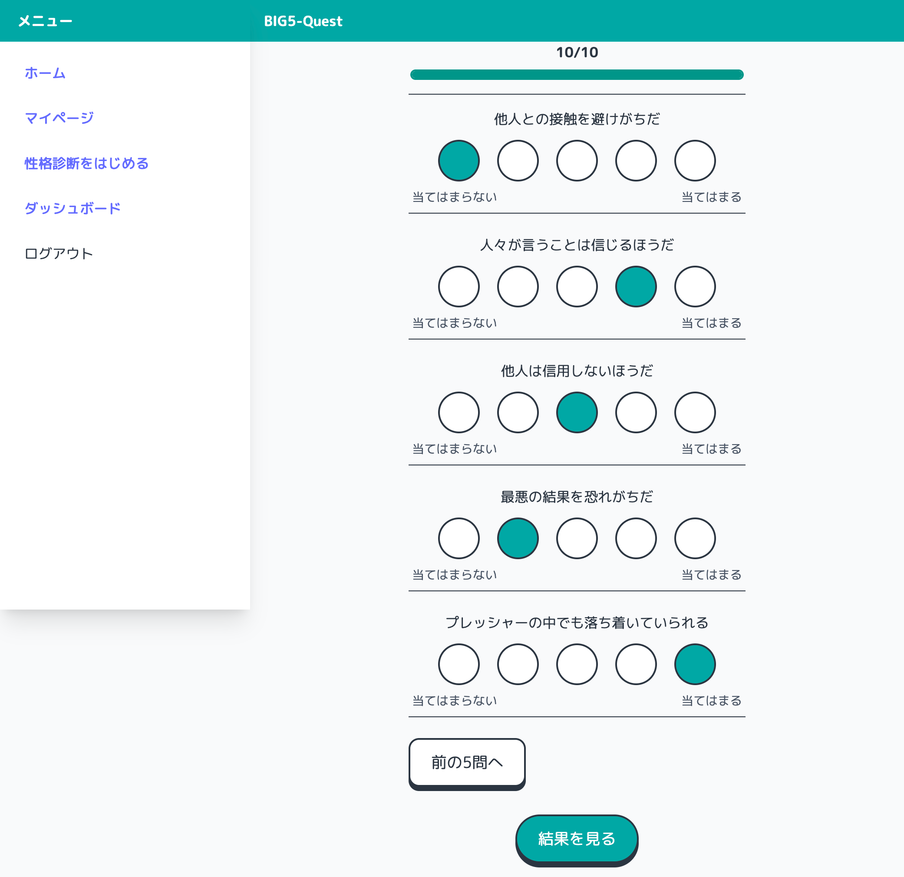
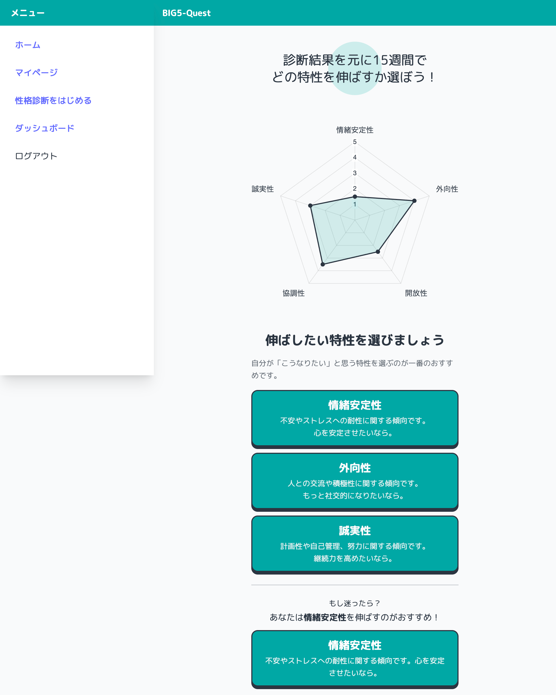
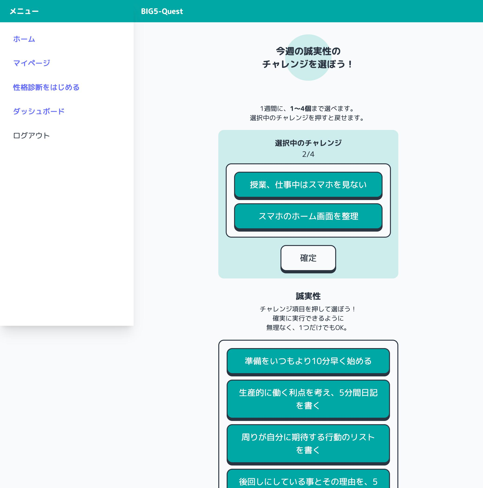
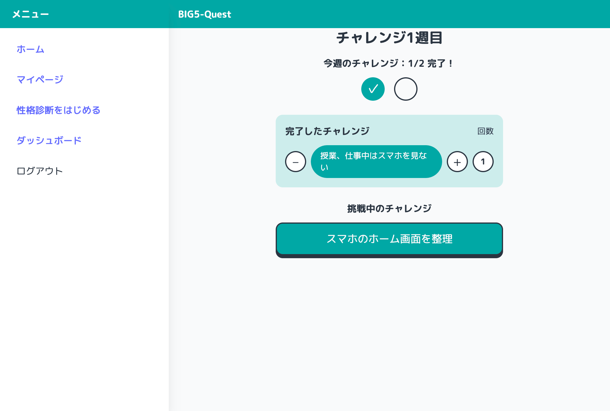
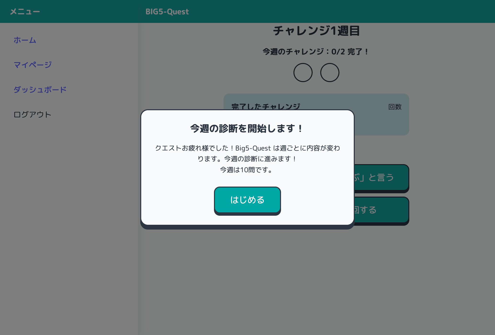
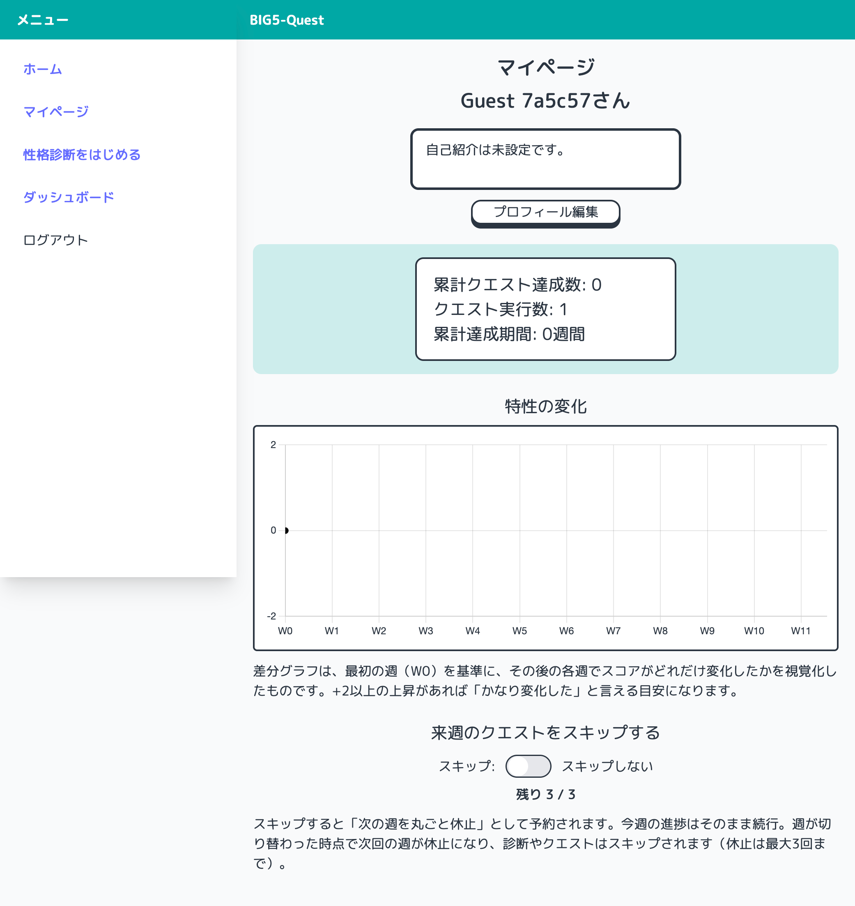
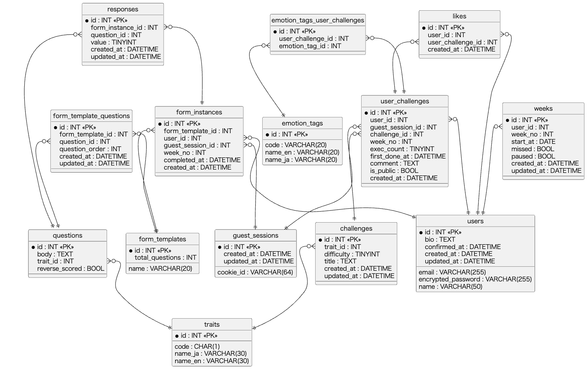
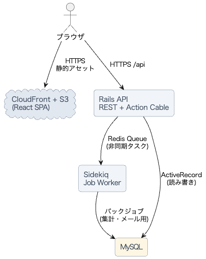

# Big5-Quest

## 概要
Big5の各特性に対して、診断と「週間チャレンジ」を組み合わせて継続改善を目指すアプリです。初期診断で基準値を取り、以降はユーザーが選んだ特性に紐付いた週次で簡単な再診断と改善行動の実践を繰り返します。

## 画面キャプチャ

### トップページ
アプリの概要と導線をまとめたページ。ゲストログインで即体験できます。
- Big5-Quest のコンセプト説明
- 「ゲストではじめる」／「新規登録」CTA

### 診断画面
フォーカス特性に合わせて出題。直感的な5段階評価でテンポよく回答できます。
- 進捗バー／残り設問数
- リッカートスケール（強くそう思う〜全く思わない）

### 診断結果画面
現在の特性スコアを可視化し伸ばしたい特性選択へ誘導します。
- グラフでの表示
- 推奨チャレンジや次のステップへの導線

### チャレンジ選択
週の始めに 1〜4 件を選択。小さく始めて継続しやすい設計です。
- 特性ごとのチャレンジ候補
- 1〜4 件の選択
- 今週の実行状況がダッシュボードに連携

### ダッシュボード
今週の状況を表示。
- 今週のチャレンジ進捗と達成数

### 1週間後モーダル
- 1週間後にアクセスするとモーダル表示し診断画面へ遷移

### マイページ
プロフィールや来週スキップなどの個人設定を管理。
- 名前／自己紹介の編集
- 来週スキップのトグル
- 累計統計

## ER 図

## インフラ構成図

## オリジナルプロダクトの URL
- フロント: https://big5-quest.com/
- API: https://api.big5-quest.com/

---

## 使用技術
- フロントエンド: React + Vite, Chart.js
- バックエンド: Ruby on Rails 8
- データベース: MySQL
- 認証: Devise + devise-jwt（JWT）、Devise Confirmable によるメール確認、パスワード再設定、ゲストログイン
- 監視: Sentry

---

## 機能一覧
- ゲストログイン
- 性格診断
  - 初週: 50問（全特性）
  - 週次: 10問（ユーザーの選択した特性のみ）
  - 4週ごと: 26問（フォーカス10 + 他特性×各4）
  - 最終: 50問（全特性）
- チャレンジ選択（週に1〜4件）
- マイページ
  - 累計統計
  - 特性差分グラフ（初回診断基準の週次変化）
  - 来週スキップ（トグルで予約と解除）
  - プロフィール編集（名前/自己紹介）
