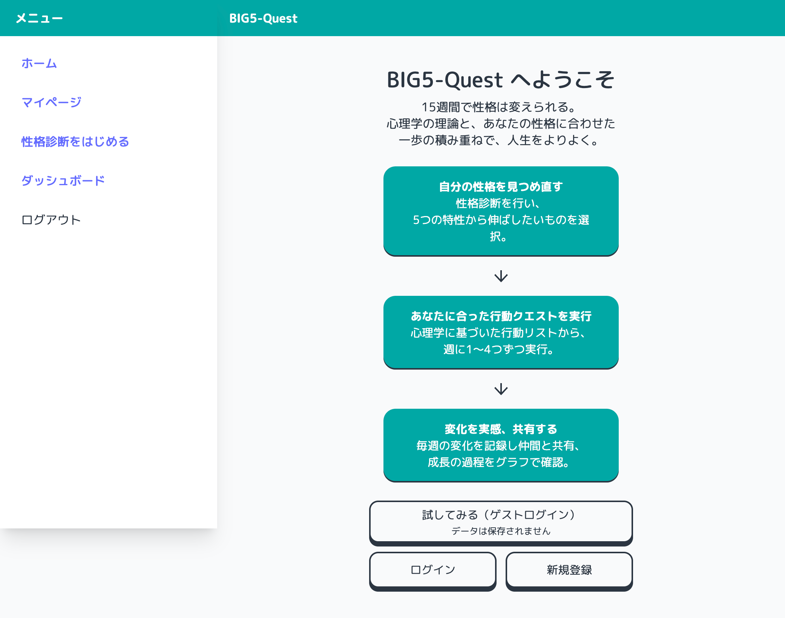
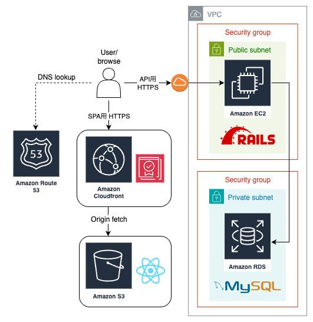

# Big5-Quest

## 概要
Big5の各特性に対して、診断と「週間チャレンジ」を組み合わせて継続改善を目指すアプリです。初期診断で基準値を取り、以降はユーザーが選んだ特性を中心に週次で簡単な再診断と改善行動の実践を繰り返します。

## 画面キャプチャ

  
  
  

 

  
  
  

## ER 図

## インフラ構成図

## オリジナルプロダクトの URL
- フロント: https://big5-quest.com/
- API: https://api.big5-quest.com/

---

## 使用技術
- フロントエンド: React + Vite, Chart.js
- バックエンド: Ruby on Rails 8
- データベース: MySQL
- 認証: トークンベース（ゲストログイン）
- 監視: Sentry

---

## 機能一覧
- ゲストログイン（ワンクリックで体験開始）
- 性格診断
  - W0（初回）: 50問（全特性）
  - 週次: 10問（ユーザーの選択した特性のみ）
  - 4週ごと: 26問（フォーカス10 + 他特性×各4）
  - W15（最終）: 50問（全特性）
- チャレンジ選択（1〜4件/週）
- マイページ
  - 累計統計（達成数/実行数/達成期間）
  - 特性差分グラフ（W0基準の週次変化）
  - 来週スキップ（トグルで予約/解除）
  - プロフィール編集（名前/自己紹介）
