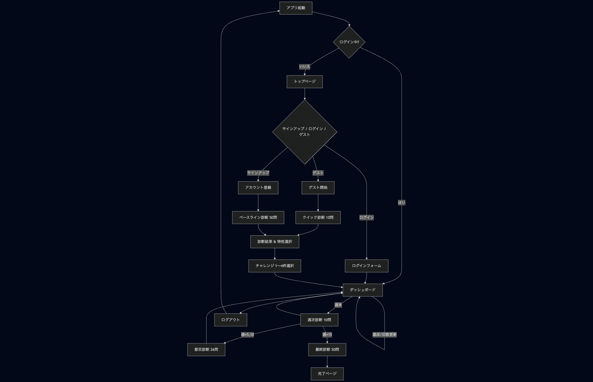

# Big5-Quest ─ 設計ドキュメント

## 1. 業務フロー

---

## 2. 画面遷移図 / ワイヤーフレーム

Figma で作成した画面遷移図はこちらから確認できます。

[Figmaリンク：画面遷移図（Big5-Quest）](https://www.figma.com/design/SdftQGSIMeKiny1Fq5vUKa/LIFEIPPO?node-id=0-1&p=f&t=01rXtAGIhl09OoWN-0)

---

## 3. ER 図 / テーブル定義

---

## 4. システム構成図

